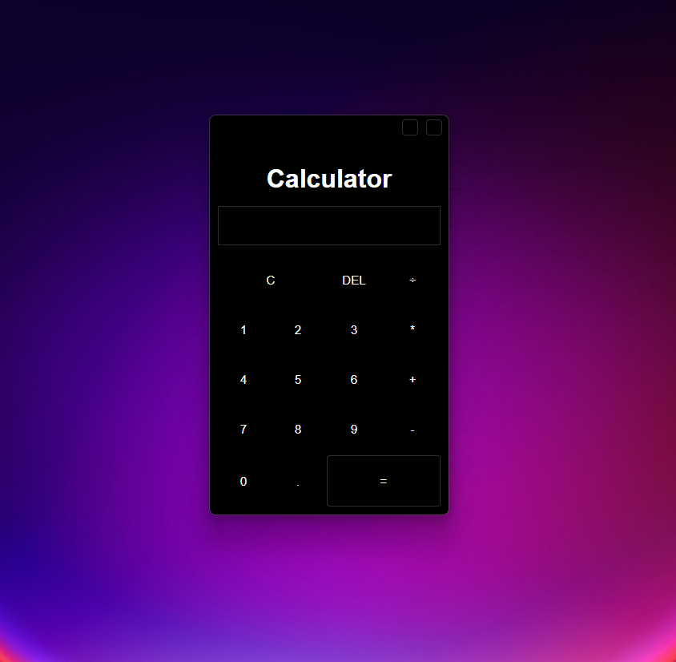

                Calculator

--------------------finished project-----------------------

1.0.0

--------------------development stage-----------------------

0.0.6 removed the dot before the operators

0.0.5 export Javascript files in data folder 

0.0.4 removed duplication of mathematical operators and duplication of points 

0.0.3 added README file

0.0.2 wrote the main logic without using the 'eval' method

0.0.1 completed basic sketches

